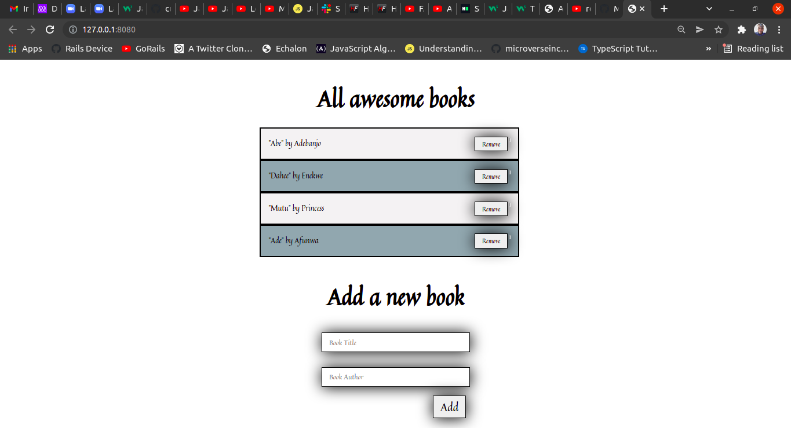

# Awesome Books

> In this project, we built a basic website - Awesome Books: plain JavaScript with objects, that allows users to add/remove books from a list.

The Awesome Books Project, which is a basic website that allows users to add/remove books from a list. This was achieved using JavaScript objects and arrays. I also dynamically modifed the DOM and add basic events.

## Built With

- JavaScript
- HTML and CSS
- Bootstrap

**Instructions on setting up your project locally.**
The project could be accessed by visiting the website link.

## Authors

👤 **Eneh Charles Chukwunweike**

- GitHub: [@charlyeneh](https://github.com/charlyeneh)
- Twitter: [@twitterhandle](https://twitter.com/ProgrammerBaby?s=09)
- LinkedIn: [LinkedIn](https://www.linkedin.com/in/charles-chukwunweike-eneh-5345a2147)

👤 **Michael Tamirie**

- GitHub: [@MichaelTamirie](https://github.com/Micky373)
- LinkedIn: [Michael_Tamirie](https://www.linkedin.com/in/michael-tamirie-288a331ab)

## 🤝 Contributing

Contributions, issues, and feature requests are welcome!

## Show your support

Give a ⭐️ if you like this project!

## Acknowledgments

- Hat tip to anyone whose code was used
- Inspiration
- etc

## 📝 License

This project is [MIT](./MIT.md) licensed.
